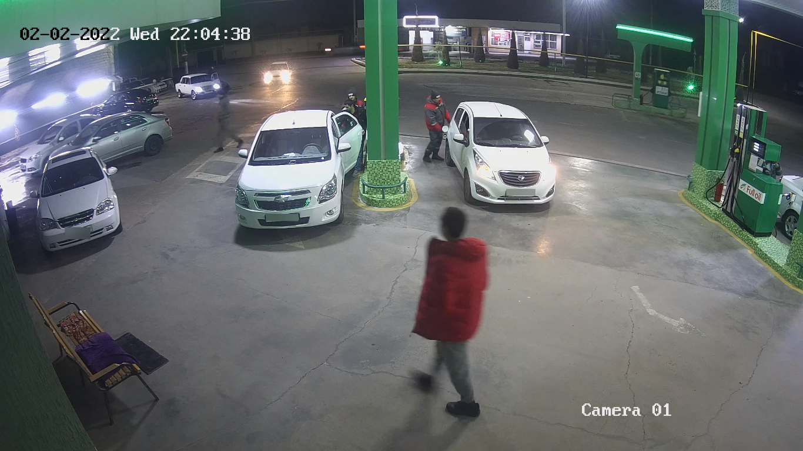

# BLURING HEADS, FACES & LICENSE PLATES IN A VIDEO, IMAGE OR WEBCAM STREAM

Mass License Plate & Head blurring using Yolov5

Simple face blurring using Mediapipe


## For bluring heads, go to "yolov5-headBlur" folder, download the model and run:

```bash
python3 detect.py --weights crowdhuman_yolov5m.pt --source _test/ --heads
```

## For bluring license plates, go to "yolov5-lpBlur" folder, download the model and run:

```bash
python3 detect.py --source [your-video.mp4 / 0 for webcam / your-image.jpg] --view-img
```

## For simple webcam face bluring:

```bash
python3 faceBlur.py
```

### SAMPLE OUTPUTS

 